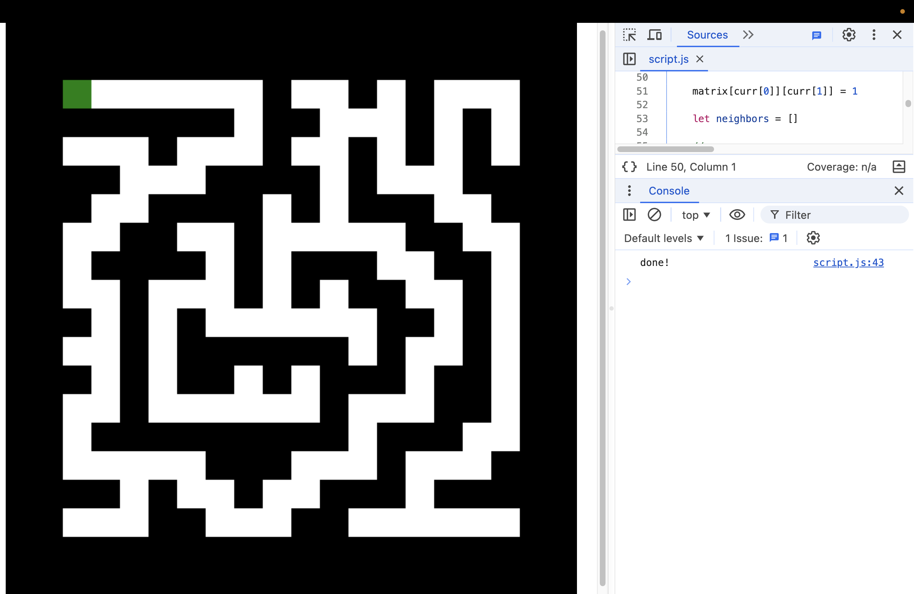

# maze-solver

for now, creates maze using DFS 

I code this with my friend using `vs code`'s `live share `, while hosting a node js server
which is the `server.js` file, and forward it using ngrok with `ngrok http 8000`, 
and then access `[ngrok-tunnel]/file/main.html`

